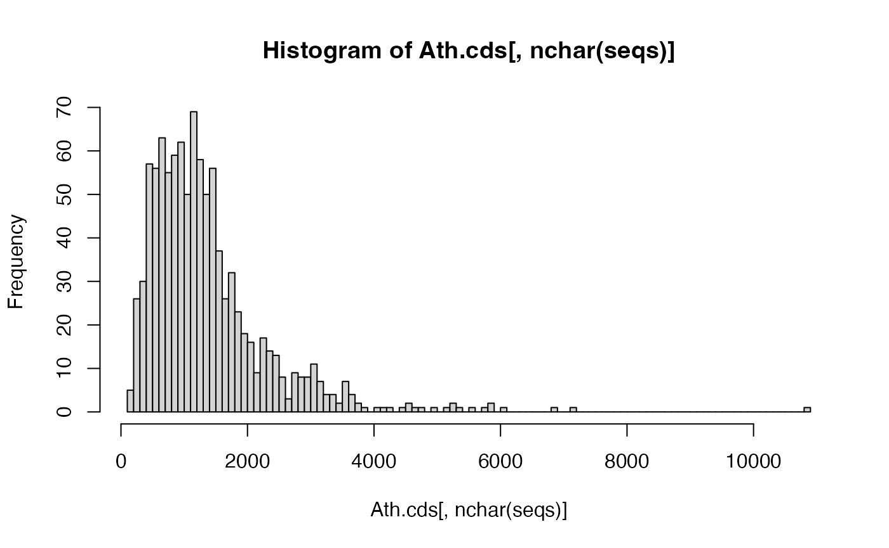

# BLAST searches using orthologr

- [1. Getting started with BLAST](#getting-started)
- [2. Core BLAST+
  Functionality](#using-orthologr-to-perform-blast-searches)
  - [2.1 The blast() function](#the-blast-function)
    - [2.1.1 Inferring with one-to-one homologous
      hits](#working-with-one-to-one-hits)
    - [2.1.2 Inferring with one-to-many homologous
      hits](#working-with-one-to-many-hits)
  - [2.2 The blast_best() function](#the-blast_best-function)
  - [2.3 The blast_rec() function](#the-blast_rec-function)
  - [2.4 The set_blast() function](#the-set_blast-function)
- [3. Perform BLAST+ searches between
  genomes](#perform-blast-searches-between-genomes)
  - [3.1 Genome and Proteome Retrieval](#genome-and-proteome-retrieval)

## Getting Started

The `orthologr` package provides several interface functions to perform
BLAST searches.

**Note:** If your goal is orthology inference or dN/dS estimation,
consider using [DIAMOND2](https://github.com/bbuchfink/diamond) instead
of BLAST — it is orders of magnitude faster and is the default aligner
in `orthologr`. See the [Orthology
Inference](https://drostlab.github.io/orthologr/articles/orthology_inference.html)
and [dN/dS
Estimation](https://drostlab.github.io/orthologr/articles/dNdS_estimation.html)
vignettes for details. The functions documented here
([`blast()`](https://drostlab.github.io/orthologr/reference/blast.md),
[`blast_best()`](https://drostlab.github.io/orthologr/reference/blast_best.md),
[`blast_rec()`](https://drostlab.github.io/orthologr/reference/blast_rec.md))
are retained for cases where BLAST output specifically is needed.

First, users need to make sure that they have
[BLAST](ftp://ftp.ncbi.nlm.nih.gov/blast/executables/blast+/LATEST/)
installed on their machine. Please follow
[these](https://drostlab.github.io/orthologr/articles/Install.html#install-blast)
instructions to install BLAST on your machine.

## Performing BLAST Searches

The `orthologr` package stores 20 example genes (orthologs) between
*Arabidopsis thaliana* and *Arabidopsis lyrata*. The following example
BLAST search shall illustrate a simple search with standard parameters
provided by the
[`blast()`](https://drostlab.github.io/orthologr/reference/blast.md)
function.

When running the subsequent functions please make sure you can call
BLAST+ from your console either in the standard `PATH` or in case you
have BLAST+ installed in a separate folder, please specify the `path`
argument that can be passed to
[`blast()`](https://drostlab.github.io/orthologr/reference/blast.md).

To check whether BLAST+ can be executed from the default `PATH`
(`usr/bin/local` on UNIX systems), you can run:

``` r

# check if blast is installed and if yes, what version of blast
system("blastp -version")
```

This should return something like this:

If everything works properly, you can get started with your first BLAST+
search.

## Using orthologr to perform BLAST searches

The `orthologr` packages allows users to perform fast and easy-to-use
BLAST searches between `fasta` files. These searches can even be scaled
towards genome and proteome comparisons.

### The blast() function

The [`blast()`](https://drostlab.github.io/orthologr/reference/blast.md)
function provides the easiest way to perform a BLAST search.

``` r

library(dplyr)
#> 
#> Attaching package: 'dplyr'
#> The following objects are masked from 'package:stats':
#> 
#>     filter, lag
#> The following objects are masked from 'package:base':
#> 
#>     intersect, setdiff, setequal, union
# performing a BLAST search using blastp (default)
hit_tbl <- blast(query_file   = system.file('seqs/ortho_thal_cds.fasta', package = 'orthologr'),
                 subject_file = system.file('seqs/ortho_lyra_cds.fasta', package = 'orthologr'))
#> Running blastp: 2.17.0+ ...
# look at results
glimpse(hit_tbl)
#> Rows: 20
#> Columns: 21
#> $ query_id          <chr> "AT1G01010.1", "AT1G01020.1", "AT1G01030.1", "AT1G01040.1", "AT1G01050.1", "AT1G01060.3", "AT1G01070.1", "AT1G01080.1", "AT1G01090.1", "AT1G01110.2", "AT1G01120.1", "AT1G01140.3", "AT1G01150.1", "AT1G01160.1", "AT1G01170.2", "AT1G01180.1", "AT1G01190.1", "AT1G01200.1", "AT1G01210.1", "AT1G01220.1"
#> $ subject_id        <chr> "333554|PACid:16033839", "470181|PACid:16064328", "470180|PACid:16054974", "333551|PACid:16057793", "909874|PACid:16064489", "470177|PACid:16043374", "918864|PACid:16052578", "909871|PACid:16053217", "470171|PACid:16052860", "333544|PACid:16034284", "918858|PACid:16049140", "470161|PACid:16036015", "918855|PACid:16037307", "918854|PACid:16044153", "311317|PACid:16052302", "909860|PACid:16056125", "311315|PACid:16059488", "470156|PACid:16041002", "311313|PACid:16057125", "470155|PACid:16047984"
#> $ perc_identity     <dbl> 73.987, 91.057, 95.543, 91.980, 100.000, 89.506, 95.082, 90.333, 96.774, 93.561, 99.244, 98.455, 72.632, 84.916, 85.567, 92.581, 94.184, 95.798, 95.327, 96.686
#> $ num_ident_matches <int> 347, 224, 343, 1812, 213, 580, 348, 271, 420, 494, 525, 446, 207, 152, 83, 287, 502, 228, 102, 1021
#> $ alig_length       <int> 469, 246, 359, 1970, 213, 648, 366, 300, 434, 528, 529, 453, 285, 179, 97, 310, 533, 238, 107, 1056
#> $ mismatches        <int> 80, 22, 12, 85, 0, 58, 14, 22, 8, 34, 4, 6, 68, 19, 0, 20, 30, 10, 5, 35
#> $ gap_openings      <int> 8, 0, 2, 10, 0, 5, 2, 2, 3, 0, 0, 1, 3, 2, 1, 1, 1, 0, 0, 0
#> $ n_gaps            <int> 42, 0, 4, 73, 0, 10, 4, 7, 6, 0, 0, 1, 10, 8, 14, 3, 1, 0, 0, 0
#> $ pos_match         <int> 370, 231, 346, 1853, 213, 601, 351, 279, 425, 507, 527, 448, 234, 157, 83, 296, 518, 233, 105, 1037
#> $ ppos              <dbl> 78.89, 93.90, 96.38, 94.06, 100.00, 92.75, 95.90, 93.00, 97.93, 96.02, 99.62, 98.90, 82.11, 87.71, 85.57, 95.48, 97.19, 97.90, 98.13, 98.20
#> $ q_start           <int> 1, 1, 1, 6, 1, 1, 1, 1, 1, 1, 1, 1, 5, 4, 2, 1, 1, 1, 1, 1
#> $ q_end             <int> 430, 246, 359, 1910, 213, 646, 366, 294, 429, 528, 529, 452, 289, 175, 84, 307, 533, 238, 107, 1056
#> $ q_len             <int> 430, 246, 359, 1910, 213, 646, 366, 294, 429, 528, 529, 452, 346, 196, 84, 479, 536, 238, 107, 1056
#> $ qcov              <dbl> 100, 100, 100, 99, 100, 100, 100, 100, 100, 100, 100, 100, 82, 88, 99, 64, 99, 100, 100, 100
#> $ qcovhsp           <dbl> 100, 100, 100, 99, 100, 100, 100, 100, 100, 100, 100, 100, 82, 88, 99, 64, 99, 100, 100, 100
#> $ s_start           <int> 1, 1, 1, 2, 1, 1, 1, 1, 1, 1, 1, 1, 16, 2, 4, 1, 6, 1, 1, 1
#> $ s_end             <int> 466, 246, 355, 1963, 213, 640, 362, 299, 433, 528, 529, 453, 290, 179, 100, 310, 537, 238, 107, 1056
#> $ s_len             <int> 466, 246, 355, 1963, 213, 640, 362, 299, 433, 528, 529, 453, 294, 225, 100, 316, 540, 238, 107, 1056
#> $ evalue            <dbl> 0.00e+00, 8.91e-168, 0.00e+00, 0.00e+00, 3.27e-162, 0.00e+00, 0.00e+00, 1.21e-180, 0.00e+00, 0.00e+00, 0.00e+00, 0.00e+00, 4.13e-152, 2.39e-95, 1.18e-55, 0.00e+00, 0.00e+00, 3.85e-174, 1.81e-77, 0.00e+00
#> $ bit_score         <dbl> 627, 454, 698, 3704, 437, 1037, 696, 491, 859, 972, 1092, 918, 421, 268, 158, 576, 1036, 470, 215, 2106
#> $ score_raw         <dbl> 1617, 1169, 1801, 9604, 1125, 2681, 1797, 1264, 2220, 2512, 2825, 2372, 1082, 685, 400, 1484, 2679, 1209, 547, 5456
```

As you can see, the hit table shows the output of the BLAST+ search. The
[`blast()`](https://drostlab.github.io/orthologr/reference/blast.md)
function runs `blastp` as default BLAST+ algorithm. Different BLAST+
algorithms can be selected by specifying the `blast_algorithm` argument,
e.g. `blast_algorithm = "tblastn"`. See
[`?blast`](https://drostlab.github.io/orthologr/reference/blast.md) for
further details. The
[`blast()`](https://drostlab.github.io/orthologr/reference/blast.md)
function returns 21 columns: `query_id`, `subject_id`, `perc_identity`,
`num_ident_matches`, `alig_length`, `mismatches`, `gap_openings`,
`n_gaps`, `pos_match`, `ppos`, `q_start`, `q_end`, `q_len`, `qcov`,
`qcovhsp`, `s_start`, `s_end`, `s_len`, `evalue`, `bit_score`, and
`score_raw`.

Since
[`blast()`](https://drostlab.github.io/orthologr/reference/blast.md)
stores the hit table returned by BLAST in a data.table object, you can
access each column, using the [data.table
notation](https://r-datatable.com).

In case you need to specify the `PATH` to BLAST+ please use the `path`
argument:

``` r

# performing a BLAST search using blastp (default)
hit_tbl <- blast(query_file   = system.file('seqs/ortho_thal_cds.fasta', package = 'orthologr'),
                 subject_file = system.file('seqs/ortho_lyra_cds.fasta', package = 'orthologr'),
                 path         = "/path/to/blastp")


hit_tbl
```

``` r

# access columns: query_id, subject_id, evalue, and bit_score
dplyr::select(hit_tbl, query_id, subject_id, evalue, bit_score)
#> # A tibble: 20 × 4
#>    query_id    subject_id               evalue bit_score
#>    <chr>       <chr>                     <dbl>     <dbl>
#>  1 AT1G01010.1 333554|PACid:16033839 0               627
#>  2 AT1G01020.1 470181|PACid:16064328 8.91e-168       454
#>  3 AT1G01030.1 470180|PACid:16054974 0               698
#>  4 AT1G01040.1 333551|PACid:16057793 0              3704
#>  5 AT1G01050.1 909874|PACid:16064489 3.27e-162       437
#>  6 AT1G01060.3 470177|PACid:16043374 0              1037
#>  7 AT1G01070.1 918864|PACid:16052578 0               696
#>  8 AT1G01080.1 909871|PACid:16053217 1.21e-180       491
#>  9 AT1G01090.1 470171|PACid:16052860 0               859
#> 10 AT1G01110.2 333544|PACid:16034284 0               972
#> 11 AT1G01120.1 918858|PACid:16049140 0              1092
#> 12 AT1G01140.3 470161|PACid:16036015 0               918
#> 13 AT1G01150.1 918855|PACid:16037307 4.13e-152       421
#> 14 AT1G01160.1 918854|PACid:16044153 2.39e- 95       268
#> 15 AT1G01170.2 311317|PACid:16052302 1.18e- 55       158
#> 16 AT1G01180.1 909860|PACid:16056125 0               576
#> 17 AT1G01190.1 311315|PACid:16059488 0              1036
#> 18 AT1G01200.1 470156|PACid:16041002 3.85e-174       470
#> 19 AT1G01210.1 311313|PACid:16057125 1.81e- 77       215
#> 20 AT1G01220.1 470155|PACid:16047984 0              2106
```

The [`blast()`](https://drostlab.github.io/orthologr/reference/blast.md)
function also allows you to pass additional parameters to the BLAST+
search using the `blast_params` argument. In the following example, a
remote BLAST+ search is performed.

``` r

hit_tbl <- blast(query_file = system.file('seqs/ortho_thal_cds.fasta', package = 'orthologr'),
                 subject_file = system.file('seqs/ortho_lyra_cds.fasta', package = 'orthologr'),
                 blast_params = "-qcov_hsp_perc 0.9")
```

``` r

glimpse(hit_tbl)
```

    Rows: 20
    Columns: 21
    $ query_id          <chr> "AT1G01010.1", "AT1G01020.1", "AT1G01030.1", "AT…
    $ subject_id        <chr> "333554|PACid:16033839", "470181|PACid:16064328"…
    $ perc_identity     <dbl> 73.987, 91.057, 95.543, 91.980, 100.000, 89.506,…
    $ num_ident_matches <int> 347, 224, 343, 1812, 213, 580, 348, 271, 420, 49…
    $ alig_length       <int> 469, 246, 359, 1970, 213, 648, 366, 300, 434, 52…
    $ mismatches        <int> 80, 22, 12, 85, 0, 58, 14, 22, 8, 34, 4, 6, 68, …
    $ gap_openings      <int> 8, 0, 2, 10, 0, 5, 2, 2, 3, 0, 0, 1, 3, 2, 1, 1,…
    $ n_gaps            <int> 42, 0, 4, 73, 0, 10, 4, 7, 6, 0, 0, 1, 10, 8, 14…
    $ pos_match         <int> 370, 231, 346, 1853, 213, 601, 351, 279, 425, 50…
    $ ppos              <dbl> 78.89, 93.90, 96.38, 94.06, 100.00, 92.75, 95.90…
    $ q_start           <int> 1, 1, 1, 6, 1, 1, 1, 1, 1, 1, 1, 1, 5, 4, 2, 1, …
    $ q_end             <int> 430, 246, 359, 1910, 213, 646, 366, 294, 429, 52…
    $ q_len             <int> 430, 246, 359, 1910, 213, 646, 366, 294, 429, 52…
    $ qcov              <dbl> 100, 100, 100, 99, 100, 100, 100, 100, 100, 100,…
    $ qcovhsp           <dbl> 100, 100, 100, 99, 100, 100, 100, 100, 100, 100,…
    $ s_start           <int> 1, 1, 1, 2, 1, 1, 1, 1, 1, 1, 1, 1, 16, 2, 4, 1,…
    $ s_end             <int> 466, 246, 355, 1963, 213, 640, 362, 299, 433, 52…
    $ s_len             <int> 466, 246, 355, 1963, 213, 640, 362, 299, 433, 52…
    $ evalue            <dbl> 0.00e+00, 8.91e-168, 0.00e+00, 0.00e+00, 3.27e-1…
    $ bit_score         <dbl> 627, 454, 698, 3704, 437, 1037, 696, 491, 859, 9…
    $ score_raw         <dbl> 1617, 1169, 1801, 9604, 1125, 2681, 1797, 1264, …

In all cases the default `e-value` BLAST+ searches is `1E-5` and the
default `blast_algorithm` is `blastp`.

Since BLAST+ searches can be computationally expensive, it is possible
to specify the `comp_cores` argument when working with an multicore
machine.

``` r


# BLAST computations using the comp_cores parameter: here with 2 cores
blast(query_file   = system.file('seqs/ortho_thal_cds.fasta', package = 'orthologr'),
      subject_file = system.file('seqs/ortho_lyra_cds.fasta', package = 'orthologr'),
      comp_cores   = 2)
#> Running blastp: 2.17.0+ ...
#> # A tibble: 20 × 21
#>    query_id    subject_id            perc_identity num_ident_matches alig_length mismatches gap_openings n_gaps pos_match  ppos q_start q_end q_len  qcov qcovhsp s_start s_end s_len    evalue bit_score score_raw
#>    <chr>       <chr>                         <dbl>             <int>       <int>      <int>        <int>  <int>     <int> <dbl>   <int> <int> <int> <dbl>   <dbl>   <int> <int> <int>     <dbl>     <dbl>     <dbl>
#>  1 AT1G01010.1 333554|PACid:16033839          74.0               347         469         80            8     42       370  78.9       1   430   430   100     100       1   466   466 0               627      1617
#>  2 AT1G01020.1 470181|PACid:16064328          91.1               224         246         22            0      0       231  93.9       1   246   246   100     100       1   246   246 8.91e-168       454      1169
#>  3 AT1G01030.1 470180|PACid:16054974          95.5               343         359         12            2      4       346  96.4       1   359   359   100     100       1   355   355 0               698      1801
#>  4 AT1G01040.1 333551|PACid:16057793          92.0              1812        1970         85           10     73      1853  94.1       6  1910  1910    99      99       2  1963  1963 0              3704      9604
#>  5 AT1G01050.1 909874|PACid:16064489         100                 213         213          0            0      0       213 100         1   213   213   100     100       1   213   213 3.27e-162       437      1125
#>  6 AT1G01060.3 470177|PACid:16043374          89.5               580         648         58            5     10       601  92.8       1   646   646   100     100       1   640   640 0              1037      2681
#>  7 AT1G01070.1 918864|PACid:16052578          95.1               348         366         14            2      4       351  95.9       1   366   366   100     100       1   362   362 0               696      1797
#>  8 AT1G01080.1 909871|PACid:16053217          90.3               271         300         22            2      7       279  93         1   294   294   100     100       1   299   299 1.21e-180       491      1264
#>  9 AT1G01090.1 470171|PACid:16052860          96.8               420         434          8            3      6       425  97.9       1   429   429   100     100       1   433   433 0               859      2220
#> 10 AT1G01110.2 333544|PACid:16034284          93.6               494         528         34            0      0       507  96.0       1   528   528   100     100       1   528   528 0               972      2512
#> 11 AT1G01120.1 918858|PACid:16049140          99.2               525         529          4            0      0       527  99.6       1   529   529   100     100       1   529   529 0              1092      2825
#> 12 AT1G01140.3 470161|PACid:16036015          98.5               446         453          6            1      1       448  98.9       1   452   452   100     100       1   453   453 0               918      2372
#> 13 AT1G01150.1 918855|PACid:16037307          72.6               207         285         68            3     10       234  82.1       5   289   346    82      82      16   290   294 4.13e-152       421      1082
#> 14 AT1G01160.1 918854|PACid:16044153          84.9               152         179         19            2      8       157  87.7       4   175   196    88      88       2   179   225 2.39e- 95       268       685
#> 15 AT1G01170.2 311317|PACid:16052302          85.6                83          97          0            1     14        83  85.6       2    84    84    99      99       4   100   100 1.18e- 55       158       400
#> 16 AT1G01180.1 909860|PACid:16056125          92.6               287         310         20            1      3       296  95.5       1   307   479    64      64       1   310   316 0               576      1484
#> 17 AT1G01190.1 311315|PACid:16059488          94.2               502         533         30            1      1       518  97.2       1   533   536    99      99       6   537   540 0              1036      2679
#> 18 AT1G01200.1 470156|PACid:16041002          95.8               228         238         10            0      0       233  97.9       1   238   238   100     100       1   238   238 3.85e-174       470      1209
#> 19 AT1G01210.1 311313|PACid:16057125          95.3               102         107          5            0      0       105  98.1       1   107   107   100     100       1   107   107 1.81e- 77       215       547
#> 20 AT1G01220.1 470155|PACid:16047984          96.7              1021        1056         35            0      0      1037  98.2       1  1056  1056   100     100       1  1056  1056 0              2106      5456
```

The `query_file` and `subject_file` arguments specify the path to the
corresponding fasta files storing the `CDS` files, `amino acid` files,
or `genome` files of the query organism and subject organism of
interest. Make sure that when using `CDS`files, `amino acid` files, or
`genome` files the corresponding argument `seq_type` must be adapted
according to the input data format.

Use :

- `CDS` files -\> `seq_type = "cds"`
- `amino acid` files -\> `seq_type = "protein"`
- `genome` files -\> `seq_type = "dna"`

The `format` argument specifies the input file format, e.g. “fasta” or
“gbk”. The `blast_algorithm` argument specifies the BLAST program
(algorithm) that shall be used to perform BLAST searches,
e.g. “blastp”,“blastn”,“tblastn”,etc. Again, the `eval` argument defines
the default e-value that shall be chosen as best hit threshold.

### Using the split-apply-combine strategy for a BLAST hit table

All `blast` functions implemented in `orthologr` can easily be processed
using the [split-apply-combine
strategy](https://www.jstatsoft.org/htaccess.php?volume=40&type=i&issue=01&filename=paper)
to detect for example `one-to-one`, `one-to-many`, and `many-to-many`
gene homology relationships.

Here a simple example:

``` r

library(dplyr)
# perform a blastp search of 20 A. thaliana genes against 1000 A. lyrata genes
hit_tbl <- blast(query_file   = system.file('seqs/ortho_thal_cds.fasta', package = 'orthologr'),
                 subject_file = system.file('seqs/ortho_lyra_cds_1000.fasta', package = 'orthologr'))
#> Running blastp: 2.17.0+ ...
#> There seem to be 12 coding sequences in your input dataset which cannot be properly divided in base triplets, because their sequence length cannot be divided by 3.
#> A fasta file storing all corrupted coding sequences for inspection was generated and stored at '/Users/sodai/Desktop/projects/R/orthologr/vignettes/ortho_lyra_cds_1000.fasta_corrupted_cds_seqs.fasta'.
#> 
#> You chose option 'delete_corrupt_cds = TRUE', thus corrupted coding sequences were removed.If after consulting the file 'ortho_lyra_cds_1000.fasta_corrupted_cds_seqs.fasta' you still wish to retain all coding sequences please specify the argument 'delete_corrupt_cds = FALSE'.
#> 

# determine 'one-to-many' and 'one-to-one' gene relationships
rel_hit_tbl <- summarize(group_by(hit_tbl, query_id), n_genes = n())
# look at results
rel_hit_tbl
#> # A tibble: 20 × 2
#>    query_id    n_genes
#>    <chr>         <int>
#>  1 AT1G01010.1       4
#>  2 AT1G01020.1       1
#>  3 AT1G01030.1       1
#>  4 AT1G01040.1       1
#>  5 AT1G01050.1       1
#>  6 AT1G01060.3       2
#>  7 AT1G01070.1       3
#>  8 AT1G01080.1       5
#>  9 AT1G01090.1       1
#> 10 AT1G01110.2       1
#> 11 AT1G01120.1       3
#> 12 AT1G01140.3      36
#> 13 AT1G01150.1       1
#> 14 AT1G01160.1       1
#> 15 AT1G01170.2       1
#> 16 AT1G01180.1       1
#> 17 AT1G01190.1       6
#> 18 AT1G01200.1       7
#> 19 AT1G01210.1       1
#> 20 AT1G01220.1       1
```

Now you can sort genes into classes: `one-to-one` and `one-to-many`.

``` r

# classify into 'one-to-one' relationships
one_to_one <- filter(rel_hit_tbl, n_genes == 1)
# classify into 'one-to-many' relationships
one_to_many <- filter(rel_hit_tbl, n_genes > 1)
```

``` r

# look at one_to_one
one_to_one 
#> # A tibble: 12 × 2
#>    query_id    n_genes
#>    <chr>         <int>
#>  1 AT1G01020.1       1
#>  2 AT1G01030.1       1
#>  3 AT1G01040.1       1
#>  4 AT1G01050.1       1
#>  5 AT1G01090.1       1
#>  6 AT1G01110.2       1
#>  7 AT1G01150.1       1
#>  8 AT1G01160.1       1
#>  9 AT1G01170.2       1
#> 10 AT1G01180.1       1
#> 11 AT1G01210.1       1
#> 12 AT1G01220.1       1
```

``` r

# look at one_to_many
one_to_many
#> # A tibble: 8 × 2
#>   query_id    n_genes
#>   <chr>         <int>
#> 1 AT1G01010.1       4
#> 2 AT1G01060.3       2
#> 3 AT1G01070.1       3
#> 4 AT1G01080.1       5
#> 5 AT1G01120.1       3
#> 6 AT1G01140.3      36
#> 7 AT1G01190.1       6
#> 8 AT1G01200.1       7
```

Now we can treat classes: `one_to_one` and `one_to_many` differently:

### Working with one-to-one hits

We can now retrieve the blast hit entries for the one-to-one hits by
joining the tables `one_to_one` and `hit_tbl`.

``` r

# look at the evalue, perc_identity, and alig_length of one_to_one genes
oo_genes <- dplyr::inner_join(one_to_one, hit_tbl , by = "query_id")
oo_genes
#> # A tibble: 12 × 22
#>    query_id    n_genes subject_id            perc_identity num_ident_matches alig_length mismatches gap_openings n_gaps pos_match  ppos q_start q_end q_len  qcov qcovhsp s_start s_end s_len    evalue bit_score score_raw
#>    <chr>         <int> <chr>                         <dbl>             <int>       <int>      <int>        <int>  <int>     <int> <dbl>   <int> <int> <int> <dbl>   <dbl>   <int> <int> <int>     <dbl>     <dbl>     <dbl>
#>  1 AT1G01020.1       1 470181|PACid:16064328          91.1               224         246         22            0      0       231  93.9       1   246   246   100     100       1   246   246 4.33e-166       454      1169
#>  2 AT1G01030.1       1 470180|PACid:16054974          95.5               343         359         12            2      4       346  96.4       1   359   359   100     100       1   355   355 0               698      1801
#>  3 AT1G01040.1       1 333551|PACid:16057793          92.0              1812        1970         85           10     73      1853  94.1       6  1910  1910    99      99       2  1963  1963 0              3704      9604
#>  4 AT1G01050.1       1 909874|PACid:16064489         100                 213         213          0            0      0       213 100         1   213   213   100     100       1   213   213 1.59e-160       437      1125
#>  5 AT1G01090.1       1 470171|PACid:16052860          96.8               420         434          8            3      6       425  97.9       1   429   429   100     100       1   433   433 0               859      2220
#>  6 AT1G01110.2       1 333544|PACid:16034284          93.6               494         528         34            0      0       507  96.0       1   528   528   100     100       1   528   528 0               972      2512
#>  7 AT1G01150.1       1 918855|PACid:16037307          72.6               207         285         68            3     10       234  82.1       5   289   346    82      82      16   290   294 2.01e-150       421      1082
#>  8 AT1G01160.1       1 918854|PACid:16044153          84.9               152         179         19            2      8       157  87.7       4   175   196    88      88       2   179   225 1.16e- 93       268       685
#>  9 AT1G01170.2       1 311317|PACid:16052302          85.6                83          97          0            1     14        83  85.6       2    84    84    99      99       4   100   100 5.75e- 54       158       400
#> 10 AT1G01180.1       1 909860|PACid:16056125          92.6               287         310         20            1      3       296  95.5       1   307   479    64      64       1   310   316 0               576      1484
#> 11 AT1G01210.1       1 311313|PACid:16057125          95.3               102         107          5            0      0       105  98.1       1   107   107   100     100       1   107   107 8.80e- 76       215       547
#> 12 AT1G01220.1       1 470155|PACid:16047984          96.7              1021        1056         35            0      0      1037  98.2       1  1056  1056   100     100       1  1056  1056 0              2106      5456
```

This way, users will have all blast information of `one_to_one` hits
available.

### A real world application: Homology Inference

Using the `oo_genes` dataset above, users can use this `one_to_one` hits
strategy to detect homologous genes between species.

For example, we could restrict `one_to_one` hits to fulfill certain
(stringent) criteria to identify as a homologous hit. Here we choose the
following parameter constellation to achieve this goal: `one_to_one`
genes must have a minimum `alignment length of 300`, a
p`erc_identity of > 80 percent` and an `e-value < 1E-5`.

``` r

# filter for 'homologous' hits
true_orthologs <- dplyr::filter(oo_genes, evalue < 1e-5, perc_identity > 80, alig_length > 300)
# look at results
dplyr::select(true_orthologs, query_id, subject_id, evalue, perc_identity, alig_length)
#> # A tibble: 6 × 5
#>   query_id    subject_id            evalue perc_identity alig_length
#>   <chr>       <chr>                  <dbl>         <dbl>       <int>
#> 1 AT1G01030.1 470180|PACid:16054974      0          95.5         359
#> 2 AT1G01040.1 333551|PACid:16057793      0          92.0        1970
#> 3 AT1G01090.1 470171|PACid:16052860      0          96.8         434
#> 4 AT1G01110.2 333544|PACid:16034284      0          93.6         528
#> 5 AT1G01180.1 909860|PACid:16056125      0          92.6         310
#> 6 AT1G01220.1 470155|PACid:16047984      0          96.7        1056
```

This way we could filter out a high confidence set of homologous genes
from the `one_to_one` class of genes.

In reality most homology inference programs and methods perform way more
complicated and sophisticated analyses to distinguish true orthologs
from true paralogs (in-paralogs, out-paralogs, etc.). These subsequent
analyses can also be performed using the above introduced
split-apply-combine strategy.

Note, that you can perform self-BLAST searches `blast(query,query)` and
`blast(subject,subject)` to distinguish between orthologous and
paralogous genes.

Now we continue with the `one_to_many` class of genes.

### Working with one-to-many hits

Here we want to address the question how to deal with multiple hits
returned by `BLAST+`.

Again we investigate all `one_to_many` genes:

``` r

# look at results 
one_to_many
#> # A tibble: 8 × 2
#>   query_id    n_genes
#>   <chr>         <int>
#> 1 AT1G01010.1       4
#> 2 AT1G01060.3       2
#> 3 AT1G01070.1       3
#> 4 AT1G01080.1       5
#> 5 AT1G01120.1       3
#> 6 AT1G01140.3      36
#> 7 AT1G01190.1       6
#> 8 AT1G01200.1       7
```

When looking at gene_id `AT1G01200.1` we see that it was found 7 times
in the corresponding subject set of *A. lyrata*.

``` r

# look at all 7 hits found
dplyr::select(dplyr::filter(hit_tbl, query_id == "AT1G01200.1"), query_id, subject_id, evalue, perc_identity, alig_length)
#> # A tibble: 7 × 5
#>   query_id    subject_id               evalue perc_identity alig_length
#>   <chr>       <chr>                     <dbl>         <dbl>       <int>
#> 1 AT1G01200.1 470156|PACid:16041002 1.87e-172          95.8         238
#> 2 AT1G01200.1 910431|PACid:16035207 2.63e- 75          53.0         219
#> 3 AT1G01200.1 918732|PACid:16054958 1.07e- 51          44.6         193
#> 4 AT1G01200.1 919287|PACid:16060536 4.42e- 70          58.1         179
#> 5 AT1G01200.1 919355|PACid:16050170 2.40e- 73          53.3         212
#> 6 AT1G01200.1 919721|PACid:16036935 2.63e- 81          59.3         204
#> 7 AT1G01200.1 919852|PACid:16055066 4.02e-  7          24.0         154
```

Now we have to decide which hit shall be considered as potential
*homolog*.

In this example `subject_id` `470156|PACid:16041002` has the highest
`perc_identity` as well as the lowest e-value `1.87e-172`. So a
straightforward approach would be to choose subject gene
`470156|PACid:16041002` as potential ortholog of query gene
`AT1G01200.1`.

We can validate this approach by running a reciprocal best hit search
with
[`blast_rec()`](https://drostlab.github.io/orthologr/reference/blast_rec.md)and
compare the output of gene `AT1G01200.1` with our choice
`470156|PACid:16041002`.

A reciprocal best hit blast approach denotes the search strategy in
which query sequences are blasted in one direction to detect matches in
subject sequences and then inversely subject sequences are blasted in
the other direction to detect matches in the query sequences. Only when
both blast seaches in both directions result in the same hit pair:
BLAST(A,B) = BLAST(B,A) the hit will be considered as true ortholog
relationship.

``` r

# run blast best reciprocal hit function
rbh_hit_tbl <- blast_rec(query_file   = system.file('seqs/ortho_thal_cds.fasta', package = 'orthologr'),
                         subject_file = system.file('seqs/ortho_lyra_cds_1000.fasta', package = 'orthologr'))
#> Running blastp: 2.17.0+ ...
#> There seem to be 12 coding sequences in your input dataset which cannot be properly divided in base triplets, because their sequence length cannot be divided by 3.
#> A fasta file storing all corrupted coding sequences for inspection was generated and stored at '/Users/sodai/Desktop/projects/R/orthologr/vignettes/ortho_lyra_cds_1000.fasta_corrupted_cds_seqs.fasta'.
#> 
#> You chose option 'delete_corrupt_cds = TRUE', thus corrupted coding sequences were removed.If after consulting the file 'ortho_lyra_cds_1000.fasta_corrupted_cds_seqs.fasta' you still wish to retain all coding sequences please specify the argument 'delete_corrupt_cds = FALSE'.
#> 
#> Running blastp: 2.17.0+ ...
#> There seem to be 12 coding sequences in your input dataset which cannot be properly divided in base triplets, because their sequence length cannot be divided by 3.
#> A fasta file storing all corrupted coding sequences for inspection was generated and stored at '/Users/sodai/Desktop/projects/R/orthologr/vignettes/ortho_lyra_cds_1000.fasta_corrupted_cds_seqs.fasta'.
#> 
#> You chose option 'delete_corrupt_cds = TRUE', thus corrupted coding sequences were removed.If after consulting the file 'ortho_lyra_cds_1000.fasta_corrupted_cds_seqs.fasta' you still wish to retain all coding sequences please specify the argument 'delete_corrupt_cds = FALSE'.
#> 
# look at results
dplyr::select(rbh_hit_tbl, query_id, subject_id, evalue, perc_identity, alig_length)
#> # A tibble: 20 × 5
#> # Groups:   query_id [20]
#>    query_id    subject_id               evalue perc_identity alig_length
#>    <chr>       <chr>                     <dbl>         <dbl>       <int>
#>  1 AT1G01010.1 333554|PACid:16033839 0                  74.0         469
#>  2 AT1G01020.1 470181|PACid:16064328 4.33e-166          91.1         246
#>  3 AT1G01030.1 470180|PACid:16054974 0                  95.5         359
#>  4 AT1G01040.1 333551|PACid:16057793 0                  92.0        1970
#>  5 AT1G01050.1 909874|PACid:16064489 1.59e-160         100           213
#>  6 AT1G01060.3 470177|PACid:16043374 0                  89.5         648
#>  7 AT1G01070.1 918864|PACid:16052578 0                  95.1         366
#>  8 AT1G01080.1 909871|PACid:16053217 5.90e-179          90.3         300
#>  9 AT1G01090.1 470171|PACid:16052860 0                  96.8         434
#> 10 AT1G01110.2 333544|PACid:16034284 0                  93.6         528
#> 11 AT1G01120.1 918858|PACid:16049140 0                  99.2         529
#> 12 AT1G01140.3 470161|PACid:16036015 0                  98.5         453
#> 13 AT1G01150.1 918855|PACid:16037307 2.01e-150          72.6         285
#> 14 AT1G01160.1 918854|PACid:16044153 1.16e- 93          84.9         179
#> 15 AT1G01170.2 311317|PACid:16052302 5.75e- 54          85.6          97
#> 16 AT1G01180.1 909860|PACid:16056125 0                  92.6         310
#> 17 AT1G01190.1 311315|PACid:16059488 0                  94.2         533
#> 18 AT1G01200.1 470156|PACid:16041002 1.87e-172          95.8         238
#> 19 AT1G01210.1 311313|PACid:16057125 8.80e- 76          95.3         107
#> 20 AT1G01220.1 470155|PACid:16047984 0                  96.7        1056
```

When we now look at gene `AT1G01200.1` we find that after an reciprocal
blast approach subject gene `470181|PACid:16064328` rather than the
subject gene `470156|PACid:16041002` (= result of unidirectional blast)
has been detected as potential ortholog. The example illustrates the
importance of using bidirectional blast to determine orthology
relationships.

An alternative analysis that can be performed with these three candidate
subject genes is the following:

``` r

# read CDS sequences of the 20 example query genes of A. thaliana
Ath.cds <- orthologr::read.cds(file   = system.file('seqs/ortho_thal_cds.fasta', package = 'orthologr'), format = "fasta")
# read CDS sequences of the 1000 example subject genes of A. lyrata
Aly.cds <- orthologr::read.cds(file   = system.file('seqs/ortho_lyra_cds_1000.fasta', package = 'orthologr'), format = "fasta")
#> There seem to be 12 coding sequences in your input dataset which cannot be properly divided in base triplets, because their sequence length cannot be divided by 3.
#> A fasta file storing all corrupted coding sequences for inspection was generated and stored at '/Users/sodai/Desktop/projects/R/orthologr/vignettes/ortho_lyra_cds_1000.fasta_corrupted_cds_seqs.fasta'.
#> 
#> You chose option 'delete_corrupt_cds = TRUE', thus corrupted coding sequences were removed.If after consulting the file 'ortho_lyra_cds_1000.fasta_corrupted_cds_seqs.fasta' you still wish to retain all coding sequences please specify the argument 'delete_corrupt_cds = FALSE'.
#> 
# show the sequence of gene AT1G01070.1
Ath.cds["AT1G01070.1" , seqs]
#> [1] "atggctggagatatgcaaggagtgagagtagtagaaaaatattcaccggtcatagtgatggtgatgtcaaatgtagcgatgggttcggtgaatgcacttgtgaagaaagctcttgatgttggtgtgaaccatatggtcattggtgcttatcgaatggctatttccgctttaattttggttccctttgcctatgtcttggaaaggaaaacaagaccacaaataacgtttaggctaatggtcgatcatttcgtcagtggccttctcggggcgagtttgatgcagtttttctttttgcttggtctgtcgtacacgtcagcaactgtttcgtgtgctttggtaagcatgttgcctgcaatcaccttcgctttggcccttattttcaggactgaaaatgtgaagattctaaagaccaaagcaggaatgttgaaggtgattggaactttgatctgtataagtggagctttgttcttaacattttacaaaggcccacaaatatcaaactctcactctcactctcacggtggggcttcccacaacaacaacgatcaagacaaggccaataattggcttcttggatgtctttatttaaccataggaacagtgttgctatctctatggatgttgtttcaagggactttaagtattaagtacccttgcaaatactcgagcacttgtcttatgtcaattttcgcggcatttcaatgtgctctcttgagcctttacaagagcagagacgttaatgattggatcatagatgatagattcgttatcaccgtcatcatatacgctggagtggtaggacaagcaatgacgacggttgcaacaacatgggggattaaaaaattaggagctgtgttcgcatcggcgtttttcccacttactctcatttcggctactctatttgatttcctcattttacacactcctttataccttggaagtgtgattggatcactagtgaccataacgggtctctacatgttcttgtgggggaagaacaaagaaacggaatcatcaactgcattgtcttcaggaatggataacgaagctcaatatactactcctaataaggataacgactctaagtcgcccgtttaa"
```

Now users can perform a global alignment between the CDS sequences of
`AT1G01070.1` and the three subject genes as follows:

``` r

library(Biostrings); library(pwalign)
#> Loading required package: BiocGenerics
#> Loading required package: generics
#> 
#> Attaching package: 'generics'
#> The following object is masked from 'package:dplyr':
#> 
#>     explain
#> The following objects are masked from 'package:base':
#> 
#>     as.difftime, as.factor, as.ordered, intersect, is.element, setdiff, setequal, union
#> 
#> Attaching package: 'BiocGenerics'
#> The following object is masked from 'package:dplyr':
#> 
#>     combine
#> The following objects are masked from 'package:stats':
#> 
#>     IQR, mad, sd, var, xtabs
#> The following objects are masked from 'package:base':
#> 
#>     anyDuplicated, aperm, append, as.data.frame, basename, cbind, colnames, dirname, do.call, duplicated, eval, evalq, Filter, Find, get, grep, grepl, is.unsorted, lapply, Map, mapply, match, mget, order, paste, pmax, pmax.int, pmin, pmin.int, Position, rank, rbind, Reduce, rownames, sapply, saveRDS, table, tapply, unique, unsplit, which.max, which.min
#> Loading required package: S4Vectors
#> Loading required package: stats4
#> 
#> Attaching package: 'S4Vectors'
#> The following objects are masked from 'package:dplyr':
#> 
#>     first, rename
#> The following object is masked from 'package:utils':
#> 
#>     findMatches
#> The following objects are masked from 'package:base':
#> 
#>     expand.grid, I, unname
#> Loading required package: IRanges
#> 
#> Attaching package: 'IRanges'
#> The following objects are masked from 'package:dplyr':
#> 
#>     collapse, desc, slice
#> Loading required package: XVector
#> Loading required package: Seqinfo
#> 
#> Attaching package: 'Biostrings'
#> The following object is masked from 'package:base':
#> 
#>     strsplit
# perform 3 global alignments between:  AT1G01070.1 and 918864|PACid:16052578, 
# 919693|PACid:16048878, 919961|PACid:16062329
sapply(Aly.cds[ unlist(dplyr::select(dplyr::filter(hit_tbl, query_id == "AT1G01070.1"), subject_id)), seqs ], pairwiseAlignment, 
       pattern = Ath.cds["AT1G01070.1" , seqs], type    = "global" )
#> $...
#> Global PairwiseAlignmentsSingleSubject (1 of 1)
#> pattern: atggctggagatatgcaaggagtgagagtagtagaaaaatattcaccggtcatagtgatggtgatgtcaaatgtagcgatgggttcggtgaatgcacttgtgaagaaagctcttgatgttggtgtgaaccatatggtcattggtgcttatcgaatggctatttccgctttaattttggttccctttgcctatgtcttggaaaggaaaacaagaccacaaataacgtttaggctaatggtcgatcatttcgtcagtggccttctcggggcgagtttgatgcagtttttctttttgcttggtctgtcgtacacgtcagcaactgtttcgtgtgctttggtaagcatgttgcctgcaatcaccttcgctttg...agagacgttaatgattggatcatagatgatagattcgttatcaccgtcatcatatacgctggagtggtaggacaagcaatgacgacggttgcaacaacatgggggattaaaaaattaggagctgtgttcgcatcggcgtttttcccacttactctcatttcggctactctatttgatttcctcattttacacactcctttataccttggaagtgtgattggatcactagtgaccataacgggtctctacatgttcttgtgggggaagaacaaagaaacggaatcatcaactgcattgtcttcaggaatggataacgaagctcaatatactactcctaataaggataacgactctaagtcgcccgtttaa
#> subject: atgggtgaaggtatgattggagtgagagtagtagaaaaatattcaccggtcatagtgatggtgatgtcaaacgtagcgatgggttcggtgaatgcacttgtgaagaaagctcttgatgttggtgtgaaccatatggtcattggtgcttatcgaatggctatttccgctttcattttggttccctttgcctatatcttggaaaggaaaacaagaccacagataacgtttaggctaatgatcgatcatttcgtcagtggccttctcggggcgagtttgatgcaatttttctttttgcttggtctgtcgtacacgtcagcaactgtttcgtgtgctttggtaagcatgttgcctgcaatcaccttcgctttg...agagacgttaatgattggatcatcgatgatagattcgtgatcaccgtcatcatatacgctggagtggtaggacaagcaatgtcgacggtagcaacaacatgggggataaagaaattaggagctgtgttcgcatcggcattttttccacttactctcatttcggctactctatttgatttcctaattttacacactcctttataccttggaagtgtgattggatcactagtgaccataacgggtctctacatgtttttgtggggcaagaacaaagaaacggaatcatcaactgcattgtcttctcgaatggataatgaagctcaaaata------ttaataaggataacgactctaagtcgcccgtttaa
#> score: 1768.965 
#> 
#> $...
#> Global PairwiseAlignmentsSingleSubject (1 of 1)
#> pattern: atggctgga---gatatgcaaggagtgagagtagtagaaaaatattcaccggtcatagtgatggtgatgt--caaatgtagcgatgggttcggtga-atgcactt---gt-gaagaaagctcttgatgttggtgtgaaccatatggtcattggtgcttatcgaatggctattt-ccgctttaattttggttccctttgcctatgtcttggaaaggaaaacaagaccacaaataacgtttaggctaatggtcgatcatttcgtcagtggccttctcggggcgagtttgatgcagtttttctttttgcttggtctgtcgtacacgtcagcaactgtttcgtgtgctttgg-taagcatgttgcctgcaatc...gctggagtggtaggacaagcaatgacgacggttgcaacaacatgggggattaaaaaattaggagctgtgttcgcatcggcgtttttc--ccacttactctcatttcggctactctattt---gatttcctcattttacacactc-ctttataccttggaagtgtgattggatcactagtgaccataacgggtctctacatgttcttgtgggggaagaaca---------------------aagaaacgga--------atcatcaactgcattgtctt--caggaatgga--taacgaagctc---aat--atactac---tcctaataaggataa------cgac----tctaagtcgcccgtttaa
#> subject: atggctaaatcagatatgc------tg---------------------ccgttcttggcgatggtgttggtgcaaatc-------ggctacgcaggcatgaacattacgtcgaagatggctatggaagccggcatgaagcctctcattctggtcgcttatcgccaga-tatttgccactatcgccacttttccggtcgcattttttctcgaacggaagacaagaccaaagatcacacttagggttcttgttcaagtcttcttctgctccattactggtgcgactggaaaccaagtgctatacttcataggacttcagaattcatctccgaccattgcttgtgccttaactaatc-tcttaccagcggtc...gccggagtggtggcgtctgcgttagcgttctgcctaatgtcatgggctatgcagaggaaaggtcctctgtacgtctctg---ttttcagccctttact-tctggtagtagtcgccattttcagctgggctcttcttgaagagaaactctacacc--ggcacgtttatgggatcagcacttgtggttattggtctctatggcgtattgtgggggaaagacagagaggtgagtgagaaggaagaagaaagggagaaggtgaaacaacaacaacgtagtaaaggcaagagtgaaagtaatgaagatattgaatcgagattaccggtcgcaagtagtggaaatggttccacaaggtctatatcgcc---ttaa
#> score: -2318.726 
#> 
#> $...
#> Global PairwiseAlignmentsSingleSubject (1 of 1)
#> pattern: atggctggagatatgcaaggagtgagagtagtagaaaaatattcaccggtcatagtgatggtgatgtcaaatgtagcgatgggttcggtgaatgcacttgtgaagaaagctcttgatgttggtgtgaaccatatggtcattggtgcttatcgaatggctatttccgctttaattttggttccctttgcctatgtcttggaaaggaaaacaagaccacaaataacgtttaggctaatggtcgatcatttcgtcagtggccttctcggggcgagtttgatgcagtttttctttttgcttggtctgtcgtacacgtcagcaactgtttcgtgtgctttggtaagcatgttgcctgcaatcaccttcgctttg...agagacgttaatgattggatcatagatgatagattcgttatcaccgtcatcatatacgctggagtggtaggacaagcaatgacgacggttgcaacaacatgggggattaaaaaattaggagctgtgttcgcatcggcgtttttcccacttactctcatttcggctactctatttgatttcctcattttacacactcctttataccttggaagtgtgattggatcactagtgaccataacgggtctctacatgttcttgtgggggaagaacaaagaaacggaatcatcaactgcattgtcttcaggaatggataacgaagctcaatatactactcctaataaggataacgactctaagtcgcccgtttaa
#> subject: atgagtgaggatatgggaggagtgaaagtagtctcaaaatggccaccggttatagttatggtggcatcacaagtagcgatgggttcggtgaatgcacttgtgaagaaagctctcgatgttggtgtgaaccatatgatcgttggtgcttatcgaatggctatttcctcgctcattctggctcctattgcctattttttggaaaggaaaataataccgcaaataacgtttaggctaatggtcgatcatttcatcagtggtttgctcggggcaagtttgatgcaatttttctatttgctgggtctgtcgtatacgtcagcaactgttgcgtgtgctttggtaagcttgatgcctgcaatcaccttcgctttc...agagatcttaaacattggatcatcgatgatggatttgtgatcggtgtcatcgtatatgctggagtgataggacaagcaatgtcgactgtagcagcgacatggggaataacgagattaggagctgttttcgcatcagcaattatgccagtttctctaatttcggctactctattcgatttcctaatcttagacactcctttatacctcggaagtgtgattggatcagtagtaacaataataggtctttacgtgttcttgtggggtaagaacaaagaaatggaagcat---------------------------------------------------------------------------------aa
#> score: 486.462
```

**Note**: To obtain the score value, you need to specify the
`scoreOnly = TRUE` in the `pairwiseAlignment` function.

As you can see, subject gene `918864|PACid:16052578` also has the
highest global alignment score `1768.965` based on the Needleman-Wunsch
algorithm. This strategy might help you to differentiate between border
line cases.

The examples shown above shall demonstrate the use cases that can be
performed using the `blast` functions implemented in `orthologr`.

Another useful analysis can be to take the length of the initial query
genes into account using the
[`nchar()`](https://rdrr.io/r/base/nchar.html) function:

``` r

# show the length distribution of all genes
# stored in "Ath.cds"
Ath.cds[ , nchar(seqs)]
#>  [1] 1290  738 1077 5730  639 1938 1098  882 1287 1584 1587 1356 1038  588  252 1437 1608  714  321 3168
```

Or the length of a specific gene:

``` r


Ath.cds["AT1G01070.1" , nchar(seqs)]
#> [1] 1098
```

This way you can easily visualize the length distribution of genes
stored in your query organism file.

``` r

Ath.cds <- read.cds(system.file('seqs/ortho_thal_cds_1000.fasta', package = 'orthologr'),
                    format = "fasta")
                    
# look at sequence length distributions
hist(Ath.cds[ , nchar(seqs)], breaks = 100)
```



## The blast_best() function

For some analyses it is sufficient to perform BLAST+ best hit searches.
The
[`blast_best()`](https://drostlab.github.io/orthologr/reference/blast_best.md)
function is optimized to perform BLAST+ best hit searches (only based on
the minimum e-value) and returns the best hit when performing a BLAST+
search of a query organisms (or set of query genes) against a subject
organism (or set of subject genes).

``` r

# performing gene orthology inference using the best hit (BH) method
blast_best(query_file    = system.file('seqs/ortho_thal_cds.fasta', package = 'orthologr'),
           subject_file  = system.file('seqs/ortho_lyra_cds.fasta', package = 'orthologr'),
           clean_folders = TRUE)
#> Running blastp: 2.17.0+ ...
#> # A tibble: 20 × 21
#> # Groups:   query_id [20]
#>    query_id    subject_id            perc_identity num_ident_matches alig_length mismatches gap_openings n_gaps pos_match  ppos q_start q_end q_len  qcov qcovhsp s_start s_end s_len    evalue bit_score score_raw
#>    <chr>       <chr>                         <dbl>             <int>       <int>      <int>        <int>  <int>     <int> <dbl>   <int> <int> <int> <dbl>   <dbl>   <int> <int> <int>     <dbl>     <dbl>     <dbl>
#>  1 AT1G01010.1 333554|PACid:16033839          74.0               347         469         80            8     42       370  78.9       1   430   430   100     100       1   466   466 0               627      1617
#>  2 AT1G01020.1 470181|PACid:16064328          91.1               224         246         22            0      0       231  93.9       1   246   246   100     100       1   246   246 8.91e-168       454      1169
#>  3 AT1G01030.1 470180|PACid:16054974          95.5               343         359         12            2      4       346  96.4       1   359   359   100     100       1   355   355 0               698      1801
#>  4 AT1G01040.1 333551|PACid:16057793          92.0              1812        1970         85           10     73      1853  94.1       6  1910  1910    99      99       2  1963  1963 0              3704      9604
#>  5 AT1G01050.1 909874|PACid:16064489         100                 213         213          0            0      0       213 100         1   213   213   100     100       1   213   213 3.27e-162       437      1125
#>  6 AT1G01060.3 470177|PACid:16043374          89.5               580         648         58            5     10       601  92.8       1   646   646   100     100       1   640   640 0              1037      2681
#>  7 AT1G01070.1 918864|PACid:16052578          95.1               348         366         14            2      4       351  95.9       1   366   366   100     100       1   362   362 0               696      1797
#>  8 AT1G01080.1 909871|PACid:16053217          90.3               271         300         22            2      7       279  93         1   294   294   100     100       1   299   299 1.21e-180       491      1264
#>  9 AT1G01090.1 470171|PACid:16052860          96.8               420         434          8            3      6       425  97.9       1   429   429   100     100       1   433   433 0               859      2220
#> 10 AT1G01110.2 333544|PACid:16034284          93.6               494         528         34            0      0       507  96.0       1   528   528   100     100       1   528   528 0               972      2512
#> 11 AT1G01120.1 918858|PACid:16049140          99.2               525         529          4            0      0       527  99.6       1   529   529   100     100       1   529   529 0              1092      2825
#> 12 AT1G01140.3 470161|PACid:16036015          98.5               446         453          6            1      1       448  98.9       1   452   452   100     100       1   453   453 0               918      2372
#> 13 AT1G01150.1 918855|PACid:16037307          72.6               207         285         68            3     10       234  82.1       5   289   346    82      82      16   290   294 4.13e-152       421      1082
#> 14 AT1G01160.1 918854|PACid:16044153          84.9               152         179         19            2      8       157  87.7       4   175   196    88      88       2   179   225 2.39e- 95       268       685
#> 15 AT1G01170.2 311317|PACid:16052302          85.6                83          97          0            1     14        83  85.6       2    84    84    99      99       4   100   100 1.18e- 55       158       400
#> 16 AT1G01180.1 909860|PACid:16056125          92.6               287         310         20            1      3       296  95.5       1   307   479    64      64       1   310   316 0               576      1484
#> 17 AT1G01190.1 311315|PACid:16059488          94.2               502         533         30            1      1       518  97.2       1   533   536    99      99       6   537   540 0              1036      2679
#> 18 AT1G01200.1 470156|PACid:16041002          95.8               228         238         10            0      0       233  97.9       1   238   238   100     100       1   238   238 3.85e-174       470      1209
#> 19 AT1G01210.1 311313|PACid:16057125          95.3               102         107          5            0      0       105  98.1       1   107   107   100     100       1   107   107 1.81e- 77       215       547
#> 20 AT1G01220.1 470155|PACid:16047984          96.7              1021        1056         35            0      0      1037  98.2       1  1056  1056   100     100       1  1056  1056 0              2106      5456
```

The
[`blast_best()`](https://drostlab.github.io/orthologr/reference/blast_best.md)
function returns 21 columns: the same format as
[`blast()`](https://drostlab.github.io/orthologr/reference/blast.md).
The most commonly used columns are `query_id`, `subject_id`,
`perc_identity`, `alig_length`, `evalue`, and `bit_score`.

``` r

# BLAST+ best hit search
best_hit_tbl <- blast_best(query_file      = system.file('seqs/ortho_thal_cds.fasta', package = 'orthologr'),
                           subject_file    = system.file('seqs/ortho_lyra_cds.fasta', package = 'orthologr'))
#> Running blastp: 2.17.0+ ...
# look at results
dplyr::glimpse(best_hit_tbl)
#> Rows: 20
#> Columns: 21
#> Groups: query_id [20]
#> $ query_id          <chr> "AT1G01010.1", "AT1G01020.1", "AT1G01030.1", "AT1G01040.1", "AT1G01050.1", "AT1G01060.3", "AT1G01070.1", "AT1G01080.1", "AT1G01090.1", "AT1G01110.2", "AT1G01120.1", "AT1G01140.3", "AT1G01150.1", "AT1G01160.1", "AT1G01170.2", "AT1G01180.1", "AT1G01190.1", "AT1G01200.1", "AT1G01210.1", "AT1G01220.1"
#> $ subject_id        <chr> "333554|PACid:16033839", "470181|PACid:16064328", "470180|PACid:16054974", "333551|PACid:16057793", "909874|PACid:16064489", "470177|PACid:16043374", "918864|PACid:16052578", "909871|PACid:16053217", "470171|PACid:16052860", "333544|PACid:16034284", "918858|PACid:16049140", "470161|PACid:16036015", "918855|PACid:16037307", "918854|PACid:16044153", "311317|PACid:16052302", "909860|PACid:16056125", "311315|PACid:16059488", "470156|PACid:16041002", "311313|PACid:16057125", "470155|PACid:16047984"
#> $ perc_identity     <dbl> 73.987, 91.057, 95.543, 91.980, 100.000, 89.506, 95.082, 90.333, 96.774, 93.561, 99.244, 98.455, 72.632, 84.916, 85.567, 92.581, 94.184, 95.798, 95.327, 96.686
#> $ num_ident_matches <int> 347, 224, 343, 1812, 213, 580, 348, 271, 420, 494, 525, 446, 207, 152, 83, 287, 502, 228, 102, 1021
#> $ alig_length       <int> 469, 246, 359, 1970, 213, 648, 366, 300, 434, 528, 529, 453, 285, 179, 97, 310, 533, 238, 107, 1056
#> $ mismatches        <int> 80, 22, 12, 85, 0, 58, 14, 22, 8, 34, 4, 6, 68, 19, 0, 20, 30, 10, 5, 35
#> $ gap_openings      <int> 8, 0, 2, 10, 0, 5, 2, 2, 3, 0, 0, 1, 3, 2, 1, 1, 1, 0, 0, 0
#> $ n_gaps            <int> 42, 0, 4, 73, 0, 10, 4, 7, 6, 0, 0, 1, 10, 8, 14, 3, 1, 0, 0, 0
#> $ pos_match         <int> 370, 231, 346, 1853, 213, 601, 351, 279, 425, 507, 527, 448, 234, 157, 83, 296, 518, 233, 105, 1037
#> $ ppos              <dbl> 78.89, 93.90, 96.38, 94.06, 100.00, 92.75, 95.90, 93.00, 97.93, 96.02, 99.62, 98.90, 82.11, 87.71, 85.57, 95.48, 97.19, 97.90, 98.13, 98.20
#> $ q_start           <int> 1, 1, 1, 6, 1, 1, 1, 1, 1, 1, 1, 1, 5, 4, 2, 1, 1, 1, 1, 1
#> $ q_end             <int> 430, 246, 359, 1910, 213, 646, 366, 294, 429, 528, 529, 452, 289, 175, 84, 307, 533, 238, 107, 1056
#> $ q_len             <int> 430, 246, 359, 1910, 213, 646, 366, 294, 429, 528, 529, 452, 346, 196, 84, 479, 536, 238, 107, 1056
#> $ qcov              <dbl> 100, 100, 100, 99, 100, 100, 100, 100, 100, 100, 100, 100, 82, 88, 99, 64, 99, 100, 100, 100
#> $ qcovhsp           <dbl> 100, 100, 100, 99, 100, 100, 100, 100, 100, 100, 100, 100, 82, 88, 99, 64, 99, 100, 100, 100
#> $ s_start           <int> 1, 1, 1, 2, 1, 1, 1, 1, 1, 1, 1, 1, 16, 2, 4, 1, 6, 1, 1, 1
#> $ s_end             <int> 466, 246, 355, 1963, 213, 640, 362, 299, 433, 528, 529, 453, 290, 179, 100, 310, 537, 238, 107, 1056
#> $ s_len             <int> 466, 246, 355, 1963, 213, 640, 362, 299, 433, 528, 529, 453, 294, 225, 100, 316, 540, 238, 107, 1056
#> $ evalue            <dbl> 0.00e+00, 8.91e-168, 0.00e+00, 0.00e+00, 3.27e-162, 0.00e+00, 0.00e+00, 1.21e-180, 0.00e+00, 0.00e+00, 0.00e+00, 0.00e+00, 4.13e-152, 2.39e-95, 1.18e-55, 0.00e+00, 0.00e+00, 3.85e-174, 1.81e-77, 0.00e+00
#> $ bit_score         <dbl> 627, 454, 698, 3704, 437, 1037, 696, 491, 859, 972, 1092, 918, 421, 268, 158, 576, 1036, 470, 215, 2106
#> $ score_raw         <dbl> 1617, 1169, 1801, 9604, 1125, 2681, 1797, 1264, 2220, 2512, 2825, 2372, 1082, 685, 400, 1484, 2679, 1209, 547, 5456
```

## The blast_rec() function

The
[`blast_rec()`](https://drostlab.github.io/orthologr/reference/blast_rec.md)
function was implemented to optimize BLAST+ reciprocal best hit searches
(only based on the minimum e-value). BLAST+ reciprocal best hit searches
are used to perform orthology inference.

Running
[`blast_rec()`](https://drostlab.github.io/orthologr/reference/blast_rec.md)
using default parameter settings:

``` r

# performing gene orthology inference using the reciprocal best hit (RBH) method
blast_rec(query_file   = system.file('seqs/ortho_thal_cds.fasta', package = 'orthologr'),
          subject_file = system.file('seqs/ortho_lyra_cds.fasta', package = 'orthologr'))
#> Running blastp: 2.17.0+ ...
#> Running blastp: 2.17.0+ ...
#> # A tibble: 20 × 21
#> # Groups:   query_id [20]
#>    query_id    subject_id            perc_identity num_ident_matches alig_length mismatches gap_openings n_gaps pos_match  ppos q_start q_end q_len  qcov qcovhsp s_start s_end s_len    evalue bit_score score_raw
#>    <chr>       <chr>                         <dbl>             <int>       <int>      <int>        <int>  <int>     <int> <dbl>   <int> <int> <int> <dbl>   <dbl>   <int> <int> <int>     <dbl>     <dbl>     <dbl>
#>  1 AT1G01010.1 333554|PACid:16033839          74.0               347         469         80            8     42       370  78.9       1   430   430   100     100       1   466   466 0               627      1617
#>  2 AT1G01020.1 470181|PACid:16064328          91.1               224         246         22            0      0       231  93.9       1   246   246   100     100       1   246   246 8.91e-168       454      1169
#>  3 AT1G01030.1 470180|PACid:16054974          95.5               343         359         12            2      4       346  96.4       1   359   359   100     100       1   355   355 0               698      1801
#>  4 AT1G01040.1 333551|PACid:16057793          92.0              1812        1970         85           10     73      1853  94.1       6  1910  1910    99      99       2  1963  1963 0              3704      9604
#>  5 AT1G01050.1 909874|PACid:16064489         100                 213         213          0            0      0       213 100         1   213   213   100     100       1   213   213 3.27e-162       437      1125
#>  6 AT1G01060.3 470177|PACid:16043374          89.5               580         648         58            5     10       601  92.8       1   646   646   100     100       1   640   640 0              1037      2681
#>  7 AT1G01070.1 918864|PACid:16052578          95.1               348         366         14            2      4       351  95.9       1   366   366   100     100       1   362   362 0               696      1797
#>  8 AT1G01080.1 909871|PACid:16053217          90.3               271         300         22            2      7       279  93         1   294   294   100     100       1   299   299 1.21e-180       491      1264
#>  9 AT1G01090.1 470171|PACid:16052860          96.8               420         434          8            3      6       425  97.9       1   429   429   100     100       1   433   433 0               859      2220
#> 10 AT1G01110.2 333544|PACid:16034284          93.6               494         528         34            0      0       507  96.0       1   528   528   100     100       1   528   528 0               972      2512
#> 11 AT1G01120.1 918858|PACid:16049140          99.2               525         529          4            0      0       527  99.6       1   529   529   100     100       1   529   529 0              1092      2825
#> 12 AT1G01140.3 470161|PACid:16036015          98.5               446         453          6            1      1       448  98.9       1   452   452   100     100       1   453   453 0               918      2372
#> 13 AT1G01150.1 918855|PACid:16037307          72.6               207         285         68            3     10       234  82.1       5   289   346    82      82      16   290   294 4.13e-152       421      1082
#> 14 AT1G01160.1 918854|PACid:16044153          84.9               152         179         19            2      8       157  87.7       4   175   196    88      88       2   179   225 2.39e- 95       268       685
#> 15 AT1G01170.2 311317|PACid:16052302          85.6                83          97          0            1     14        83  85.6       2    84    84    99      99       4   100   100 1.18e- 55       158       400
#> 16 AT1G01180.1 909860|PACid:16056125          92.6               287         310         20            1      3       296  95.5       1   307   479    64      64       1   310   316 0               576      1484
#> 17 AT1G01190.1 311315|PACid:16059488          94.2               502         533         30            1      1       518  97.2       1   533   536    99      99       6   537   540 0              1036      2679
#> 18 AT1G01200.1 470156|PACid:16041002          95.8               228         238         10            0      0       233  97.9       1   238   238   100     100       1   238   238 3.85e-174       470      1209
#> 19 AT1G01210.1 311313|PACid:16057125          95.3               102         107          5            0      0       105  98.1       1   107   107   100     100       1   107   107 1.81e- 77       215       547
#> 20 AT1G01220.1 470155|PACid:16047984          96.7              1021        1056         35            0      0      1037  98.2       1  1056  1056   100     100       1  1056  1056 0              2106      5456
```

## The set_blast() function

The
[`set_blast()`](https://drostlab.github.io/orthologr/reference/set_blast.md)function
reads a file storing a specific sequence type, such as “cds”, “protein”,
or “dna” in a standard sequence file format such as “fasta”, etc. and
depending of the makedb parameter either creates a blast-able database,
or returns the corresponding protein sequences as data.table object for
further BLAST searches.

``` r

# using set_blast() to generate a blastable sequence database
head(set_blast(file = system.file('seqs/ortho_thal_cds.fasta', package = 'orthologr'))[[1]] , 2)
#> Key: <geneids>
#>        geneids
#>         <char>
#> 1: AT1G01010.1
#> 2: AT1G01020.1
#>                                                                                                                                                                                                                                                                                                                                                                                                                                                                                                                                                                                                                                                                                                                                                                                                                                                                                                                                                                                                                                                                                                                                                                                                                                                                                                                                          seqs
#>                                                                                                                                                                                                                                                                                                                                                                                                                                                                                                                                                                                                                                                                                                                                                                                                                                                                                                                                                                                                                                                                                                                                                                                                                                                                                                                                        <char>
#> 1: atggaggatcaagttgggtttgggttccgtccgaacgacgaggagctcgttggtcactatctccgtaacaaaatcgaaggaaacactagccgcgacgttgaagtagccatcagcgaggtcaacatctgtagctacgatccttggaacttgcgcttccagtcaaagtacaaatcgagagatgctatgtggtacttcttctctcgtagagaaaacaacaaagggaatcgacagagcaggacaacggtttctggtaaatggaagcttaccggagaatctgttgaggtcaaggaccagtggggattttgtagtgagggctttcgtggtaagattggtcataaaagggttttggtgttcctcgatggaagataccctgacaaaaccaaatctgattgggttatccacgagttccactacgacctcttaccagaacatcagaggacatatgtcatctgcagacttgagtacaagggtgatgatgcggacattctatctgcttatgcaatagatcccactcccgcttttgtccccaatatgactagtagtgcaggttctgtggtcaaccaatcacgtcaacgaaattcaggatcttacaacacttactctgagtatgattcagcaaatcatggccagcagtttaatgaaaactctaacattatgcagcagcaaccacttcaaggatcattcaaccctctccttgagtatgattttgcaaatcacggcggtcagtggctgagtgactatatcgacctgcaacagcaagttccttacttggcaccttatgaaaatgagtcggagatgatttggaagcatgtgattgaagaaaattttgagtttttggtagatgaaaggacatctatgcaacagcattacagtgatcaccggcccaaaaaacctgtgtctggggttttgcctgatgatagcagtgatactgaaactggatcaatgattttcgaagacacttcgagctccactgatagtgttggtagttcagatgaaccgggccatactcgtatagatgatattccatcattgaacattattgagcctttgcacaattataaggcacaagagcaaccaaagcagcagagcaaagaaaaggtgataagttcgcagaaaagcgaatgcgagtggaaaatggctgaagactcgatcaagatacctccatccaccaacacggtgaagcagagctggattgttttggagaatgcacagtggaactatctcaagaacatgatcattggtgtcttgttgttcatctccgtcattagttggatcattcttgttggttaa
#> 2:                                                                                                                                                                                                                                                                                                                                                                                                                                                                                                                                                                         atggcggcgagtgaacacagatgcgtgggatgtggttttagggtaaagtcattgttcattcaatactctccgggtaacattcgtctcatgaaatgcggaaattgcaaggaagtagcagatgagtacatcgagtgtgaacgcatgattattttcatcgatttaatccttcacagaccaaaggtatatagacacgtcctctacaatgcaattaatccagcaactgtcaatattcagcatctgttgtggaagttggtcttcgcctatcttcttctagactgttatagaagcttgctactgagaaaaagtgatgaagaatcgagcttttctgatagccctgttcttctatctataaaggttctgattggtgtcttatctgcaaacgctgcatttatcatctcttttgccattgcgactaagggtttgctaaatgaagtttccagaagaagagagattatgttggggatattcatctctagttacttcaagatatttctgcttgcgatgttggtatgggaattcccaatgtcagtgattttttttgtcgatatacttctcttaacatcaaactccatggctcttaaagtgatgactgaatcaacaatgaccagatgcatagccgtatgcttaatcgcgcacttgattagattcttggtgggtcagatttttgagccgacaatatttttgatacaaattggatctctgttgcaatatatgtcttattttttcagaatcgtatga
#>                                                                                                                                                                                                                                                                                                                                                                                                                                                aa
#>                                                                                                                                                                                                                                                                                                                                                                                                                                            <char>
#> 1: MEDQVGFGFRPNDEELVGHYLRNKIEGNTSRDVEVAISEVNICSYDPWNLRFQSKYKSRDAMWYFFSRRENNKGNRQSRTTVSGKWKLTGESVEVKDQWGFCSEGFRGKIGHKRVLVFLDGRYPDKTKSDWVIHEFHYDLLPEHQRTYVICRLEYKGDDADILSAYAIDPTPAFVPNMTSSAGSVVNQSRQRNSGSYNTYSEYDSANHGQQFNENSNIMQQQPLQGSFNPLLEYDFANHGGQWLSDYIDLQQQVPYLAPYENESEMIWKHVIEENFEFLVDERTSMQQHYSDHRPKKPVSGVLPDDSSDTETGSMIFEDTSSSTDSVGSSDEPGHTRIDDIPSLNIIEPLHNYKAQEQPKQQSKEKVISSQKSECEWKMAEDSIKIPPSTNTVKQSWIVLENAQWNYLKNMIIGVLLFISVISWIILVG*
#> 2:                                                                                                                                                                                         MAASEHRCVGCGFRVKSLFIQYSPGNIRLMKCGNCKEVADEYIECERMIIFIDLILHRPKVYRHVLYNAINPATVNIQHLLWKLVFAYLLLDCYRSLLLRKSDEESSFSDSPVLLSIKVLIGVLSANAAFIISFAIATKGLLNEVSRRREIMLGIFISSYFKIFLLAMLVWEFPMSVIFFVDILLLTSNSMALKVMTESTMTRCIAVCLIAHLIRFLVGQIFEPTIFLIQIGSLLQYMSYFFRIV*
```

## Advanced BLAST+ analyses

For large-scale applications of BLAST+ analysis within R, we recommend
users to see the [metablastr](https://github.com/drostlab/metablastr)
package which aims to provide an easy-to-use BLAST search framework for
massive genome comparisons.
